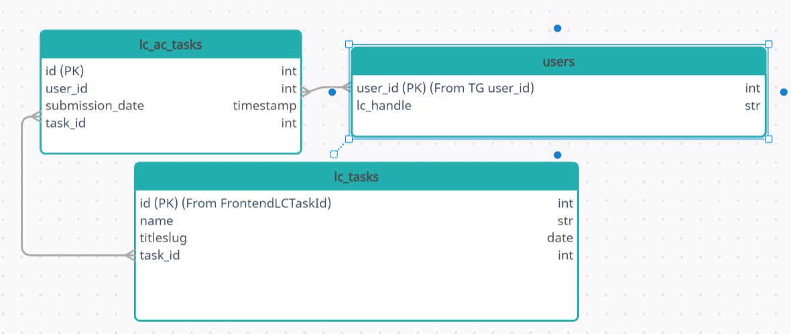

<h2 align="center"> My Final Python Project </h2>

This is a Telegram bot that allows you to view in a convenient format the latest personal 
successful submissions of tasks that users have solved on <a>LeetCode.com</a>.
</h4>

<h3 align="center"> App Architecture: </h3>

<pre>
<code style="display: block">
...
config.py: load .env file
.env file: secret information (keys, password, etc.)
src
├── bot
|    ├── bot.py: main bot py file
|    ├── schemas.py: schemas for correct bot work
|    └── utils.py
|
└── database
|    ├── database.py: main connection.
|    └── utils.py: database work functions
|
└── parser
|    ├── parser.py: main parser file. GrapQL parser
|    ├── schemas.py: classes for convenient work
|    └── utils.py
|
└── main.py: main file.
</code> 
</pre>

<h3 align="center"> Database Architecture: </h3>

<h3 align="center"> How it works: </h3>
The startup comes from the src.main.py file.
The botMain function is launched from it, which starts the telegram bot.  
<b>The telegram bot has 2 handlers - start command and message. 
All commands are validated through the message handler. </b>  
Let's analyze the main command. As soon as the user types the <b>/viewLCSubmissions</b> command, the parser will fetch 
the last 5 solved problems via GraphQL query, save them in the database, 
and the attempts themselves will be taken from the database.  
Primarily use <b>asynchronous</b> work during program execution work.

<h3 align="center"> Used Libraries and technologies: </h3>

<h3 align="center"> My Contacts </h3>
<b>Telegram:
  
Gmail:
 </b>

<h3 align="center"> Thanks for watching and reading! </h3>